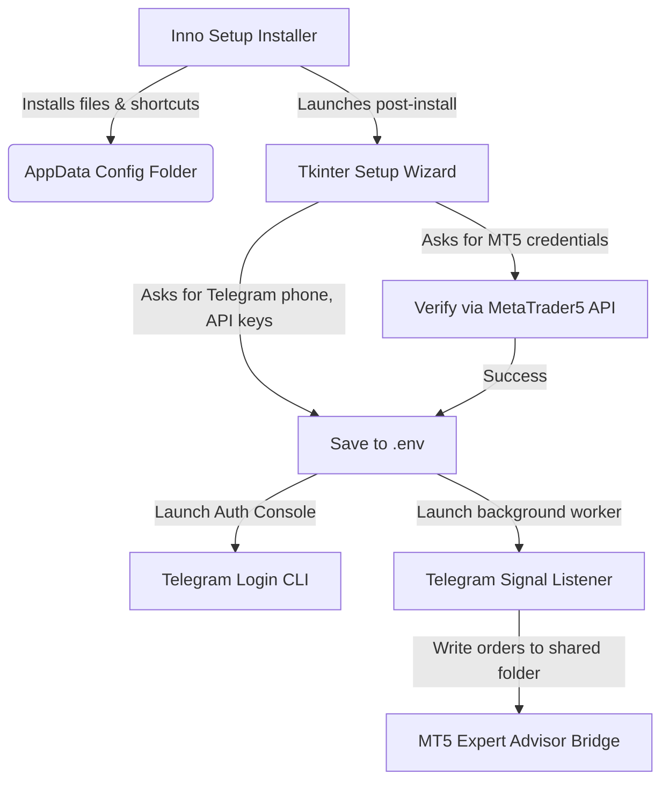

# Deployment System & Windows Executable (EXE) Packaging Guide

This guide describes how to bundle, configure, and install the **Telegram Signal Copier** as a native Windows application. It details how the python service, the Tkinter setup wizard, and the MetaTrader 5 (MT5) Expert Advisor (EA) interact, and how to verify credentials during setup.

---

## 1. System Architecture & Setup Flow

The package is built as a single Windows installer (`TelegramSignalCopier-Setup.exe`). When the user runs this installer, it installs the program files, sets up shortcut icons, and auto-runs a GUI Setup Wizard.



### Path Conventions
* **Frozen Executable (`sys.frozen = True`)**: Config files (including `.env` and SQLite sessions) are stored under `%APPDATA%\TelegramSignalCopier` (i.e. `C:\Users\<User>\AppData\Roaming\TelegramSignalCopier`) so they persist across application updates.
* **Developer Mode**: Config files default to the project root directory.
* **MT5 Shared Bridge Folder**: Commands are written to the common MetaQuotes path:
  `%APPDATA%\MetaQuotes\Terminal\Common\Files\TelegramSignalCopierBridge`

---

## 2. Step 1: Upgrading the Wizard to Verify MT5 Credentials

Currently, your Tkinter setup wizard (`setup_wizard.py`) collects the MT5 account number, password, and server name but writes them directly to `.env` without checking if they are correct. 

To ensure the app **connects properly with MT5** before finishing:
1. We add `MetaTrader5` (Windows-only library) to our packages.
2. We verify the connection inside the MT5 wizard page before letting the user click **Next**.

### Update Dependencies in `pyproject.toml`
Add `MetaTrader5` under `[project.optional-dependencies]` or install it in your environment:
```toml
[project.optional-dependencies]
# ...
build = ["pyinstaller>=6.11.0", "MetaTrader5>=5.0.45"]
```

### Update MT5 Credential Verification Code
You can replace the `validate` method in `MT5Page` inside `src/telegram_signal_copier/setup_wizard.py` with this code, which runs a non-blocking background connection check to verify the credentials with the MT5 terminal:

```python
import threading
import tkinter as tk
from tkinter import messagebox

# Import MT5 inside the validate routine to avoid errors on non-Windows platforms
def verify_mt5_login(login: int, password: str, server: str) -> str | None:
    """Attempt to initialize MT5 and authenticate. Returns error message if failed, else None."""
    try:
        import MetaTrader5 as mt5
    except ImportError:
        return "MetaTrader5 package is not installed."
        
    # Start MT5 terminal and authenticate
    if not mt5.initialize(login=login, password=password, server=server):
        err_code, err_desc = mt5.last_error()
        mt5.shutdown()
        return f"Could not connect to MT5 (Code {err_code}): {err_desc}"
        
    # Check if we are connected to the broker
    terminal_info = mt5.terminal_info()
    if terminal_info is None:
        mt5.shutdown()
        return "Failed to fetch terminal info."
        
    # Verify account details
    account_info = mt5.account_info()
    if account_info is None:
        mt5.shutdown()
        return "Credentials rejected by the MT5 server."
        
    # Success
    mt5.shutdown()
    return None

# Integrate this inside the MT5Page validate method
class MT5Page(_Page):
    # ... (existing UI fields) ...

    def validate(self) -> str | None:
        login_str = self._vars["mt5_login"].get().strip()
        password = self._vars["mt5_password"].get().strip()
        server = self._vars["mt5_server"].get().strip()
        
        if not login_str.isdigit():
            return "MT5 Account Login must be a number"
        if not password:
            return "Password is required"
        if not server:
            return "Broker Server is required"
            
        # Display progress popup during check
        progress = tk.Toplevel(self)
        progress.title("Verifying...")
        progress.geometry("300x100")
        progress.transient(self)
        progress.grab_set()
        
        # Center progress window
        x = self.winfo_toplevel().winfo_x() + 110
        y = self.winfo_toplevel().winfo_y() + 200
        progress.geometry(f"+{x}+{y}")
        
        tk.Label(progress, text="Connecting to MetaTrader 5...\nPlease make sure MT5 is installed and running.", wraplength=260, pady=15).pack()
        
        result_err = []
        def run_check():
            err = verify_mt5_login(int(login_str), password, server)
            result_err.append(err)
            progress.destroy()
            
        t = threading.Thread(target=run_check)
        t.start()
        self.wait_window(progress) # Block GUI thread until progress window closes
        
        if result_err and result_err[0] is not None:
            return f"MT5 Authentication Failed:\n{result_err[0]}"
            
        return None
```

---

## 3. Step 2: PyInstaller Executable Compilation

The spec file collects:
1. `__main__.py` as the entry script.
2. The MT5 Expert Advisor (`TelegramSignalCopierEA.mq5`) so it is bundled and extracted into the program directory. The user can locate it there and copy it into their MT5 installation folder.
3. Portable Tesseract dependencies (if OCR capability is used for image signals).

### Portable Tesseract DLL Dependencies (For Clean RDP/VPS Deployments)

Clean Windows machines or VPS/RDP hosts lack standard developer runtimes. To ensure the bundled OCR engine works, the `tesseract.exe` and `libtesseract-5.dll` binaries require several library dependencies. 

Before running the compiler, make sure you copy **all** DLL files from your local Tesseract-OCR directory (`C:\Program Files\Tesseract-OCR\`) into `packaging/tesseract-portable/` to ensure all dependencies (like `libcurl-4.dll`, `libb2-1.dll`, `libbrotlidec.dll`, etc.) are bundled:
```powershell
Copy-Item "C:\Program Files\Tesseract-OCR\*.dll" -Destination "packaging\tesseract-portable" -Force
```

The spec file is configured to recursively find all `.dll` files in the `tesseract-portable` folder and bundle them under the `tesseract/` output folder automatically.

### PyInstaller Configuration File (`packaging/TelegramSignalCopier.spec`)
Keep the spec configuration robust by specifying the layout, hidden imports, and data inclusion. Here is the reference setup:

```python
# -*- mode: python ; coding: utf-8 -*-
from pathlib import Path
import os

SPEC_DIR = Path(globals().get("SPECPATH", Path.cwd() / "packaging")).resolve()
ROOT = SPEC_DIR.parent

datas = [
    (str(ROOT / ".env.example"), "."),
    (str(ROOT / "README.md"), "."),
    # Bundling the Expert Advisor so users can copy it directly to their MT5 experts folder
    (str(ROOT / "mt5" / "Experts" / "TelegramSignalCopierEA.mq5"), "mt5/Experts"),
]

# Bundle portable Tesseract OCR if files are placed in "tesseract-portable"
_tess_portable = SPEC_DIR / "tesseract-portable"
if _tess_portable.exists():
    datas += [
        (str(_tess_portable / "tesseract.exe"), "tesseract"),
        (str(_tess_portable / "libtesseract-5.dll"), "tesseract"),
        (str(_tess_portable / "tessdata"), "tesseract/tessdata"),
    ]
    for _dll in _tess_portable.glob("*.dll"):
        datas += [(str(_dll), "tesseract")]

hiddenimports = [
    "telethon.crypto", "telethon.network", "telethon.sessions", 
    "telethon.tl.functions", "telethon.tl.types", "telethon.events",
    "pytesseract", "tkinter", "tkinter.ttk", "tkinter.messagebox",
    "cryptg", "MetaTrader5"
]

a = Analysis(
    [str(ROOT / "src" / "telegram_signal_copier" / "__main__.py")],
    pathex=[str(ROOT / "src")],
    binaries=[],
    datas=datas,
    hiddenimports=hiddenimports,
    hookspath=[],
    hooksconfig={},
    runtime_hooks=[str(SPEC_DIR / "hook_tesseract_bundled.py")] if (SPEC_DIR / "hook_tesseract_bundled.py").exists() else [],
    excludes=["win32com", "win32api", "_ssl"],
    noarchive=False,
)
pyz = PYZ(a.pure)

exe = EXE(
    pyz,
    a.scripts,
    [],
    exclude_binaries=True,
    name="TelegramSignalCopier",
    debug=False,
    bootloader_ignore_signals=False,
    strip=False,
    upx=False,
    console=True, # Set to True to allow console inputs during Telegram interactive login
)

coll = COLLECT(
    exe,
    a.binaries,
    a.zipfiles,
    a.datas,
    strip=False,
    upx=False,
    upx_exclude=[],
    name="TelegramSignalCopier",
)
```

---

## 4. Step 3: Inno Setup Installer Generation

Use **Inno Setup** to compile the built application directory into a professional installer package that performs clean directory mapping.

### Inno Setup Configuration Script (`packaging/TelegramSignalCopier.iss`)

```ini
#define MyAppName "Telegram Signal Copier"
#ifndef AppVersion
  #define AppVersion "0.1.0"
#endif
#define MyAppExeName "TelegramSignalCopier.exe"

[Setup]
AppId={{B91ED964-6A10-4C42-9D85-D322AC0F61B8}
AppName={#MyAppName}
AppVersion={#AppVersion}
AppPublisher=Telegram Signal Copier
DefaultDirName={autopf}\Telegram Signal Copier
DefaultGroupName={#MyAppName}
OutputDir=..\dist\installer
OutputBaseFilename=TelegramSignalCopier-Setup
Compression=lzma
SolidCompression=yes
WizardStyle=modern
ArchitecturesAllowed=x64compatible
ArchitecturesInstallIn64BitMode=x64compatible
DisableProgramGroupPage=yes
PrivilegesRequired=admin
UninstallDisplayIcon={app}\{#MyAppExeName}

[Files]
; Copy all compiled binaries and assets to Program Files directory
Source: "..\dist\TelegramSignalCopier\*"; DestDir: "{app}"; Flags: ignoreversion recursesubdirs createallsubdirs
; Copy the default environment template into AppData path for persistent user storage
Source: "..\.env.example"; DestDir: "{userappdata}\TelegramSignalCopier"; DestName: ".env.example"; Flags: onlyifdoesntexist

[Icons]
; Start Menu Icons
Name: "{group}\Setup Wizard"; Filename: "{app}\{#MyAppExeName}"; Parameters: "setup"; WorkingDir: "{userappdata}\TelegramSignalCopier"; Comment: "First-run configuration wizard"
Name: "{group}\Start Listener"; Filename: "{app}\{#MyAppExeName}"; Parameters: "listen"; WorkingDir: "{userappdata}\TelegramSignalCopier"
Name: "{group}\Telegram Login"; Filename: "{app}\{#MyAppExeName}"; Parameters: "login"; WorkingDir: "{userappdata}\TelegramSignalCopier"
Name: "{group}\Open Config Folder"; Filename: "{win}\explorer.exe"; Parameters: """{userappdata}\TelegramSignalCopier"""
Name: "{group}\README"; Filename: "{app}\README.md"

[Run]
; Auto-launch the wizard on installer success
Filename: "{app}\{#MyAppExeName}"; Parameters: "setup"; WorkingDir: "{userappdata}\TelegramSignalCopier"; Description: "Run Setup Wizard now"; Flags: postinstall nowait skipifsilent
```

---

## 5. Step 4: Build Orchestration Script (`packaging/build_windows_bundle.ps1`)

Execute the compile sequence automatically using this PowerShell script. It configures python virtual environments, installs requirements, calls PyInstaller, and builds the Inno Setup installer.

```powershell
param(
    [switch]$Clean,
    [switch]$SkipInstaller,
    [string]$PythonExe = ""
)

$ErrorActionPreference = "Stop"

$RepoRoot = Split-Path -Parent $PSScriptRoot
Set-Location $RepoRoot

if (-not $PythonExe) {
    $VenvPython = Join-Path $RepoRoot ".venv\Scripts\python.exe"
    if (Test-Path $VenvPython) {
        $PythonExe = $VenvPython
    }
    else {
        $PythonExe = "python"
    }
}

function Invoke-Python {
    param(
        [Parameter(Mandatory = $true)]
        [string[]]$Arguments
    )
    & $PythonExe @Arguments
    if ($LASTEXITCODE -ne 0) {
        throw "Python command failed: $PythonExe $($Arguments -join ' ')"
    }
}

function Find-Iscc {
    $candidates = @(
        (Join-Path ${env:ProgramFiles(x86)} "Inno Setup 6\ISCC.exe"),
        (Join-Path $env:ProgramFiles "Inno Setup 6\ISCC.exe"),
        (Join-Path $env:LOCALAPPDATA "Programs\Inno Setup 6\ISCC.exe"),
        (Join-Path $env:APPDATA "Programs\Inno Setup 6\ISCC.exe")
    )
    foreach ($candidate in $candidates) {
        if ($candidate -and (Test-Path $candidate)) {
            return $candidate
        }
    }
    return $null
}

if ($Clean) {
    Write-Host "Stopping any running instances of TelegramSignalCopier or Python in this project to clear file locks..."
    Get-Process -Name TelegramSignalCopier -ErrorAction SilentlyContinue | Stop-Process -Force
    Get-Process -Name python -ErrorAction SilentlyContinue | Where-Object {
        try { $_.Path -like "*Telegram signal Copier*" } catch { $false }
    } | Stop-Process -Force
    Start-Sleep -Seconds 1 # Allow file system handles to close

    Remove-Item (Join-Path $RepoRoot "build") -Recurse -Force -ErrorAction SilentlyContinue
    Remove-Item (Join-Path $RepoRoot "dist") -Recurse -Force -ErrorAction SilentlyContinue
}

Write-Host "Running packaging script using Python: $PythonExe"
Invoke-Python -Arguments @("-m", "pip", "install", "--upgrade", "pip")
Invoke-Python -Arguments @("-m", "pip", "install", "-r", "requirements.txt")
Invoke-Python -Arguments @("-m", "pip", "install", "MetaTrader5")  # Ensure MT5 library is loaded
Invoke-Python -Arguments @("-m", "pip", "install", "-e", ".[telegram,build]")
Invoke-Python -Arguments @("-m", "PyInstaller", "--noconfirm", "--clean", "packaging\TelegramSignalCopier.spec")

$bundlePath = Join-Path $RepoRoot "dist\TelegramSignalCopier\TelegramSignalCopier.exe"
if (-not (Test-Path $bundlePath)) {
    throw "PyInstaller Build finished but executable is missing: $bundlePath"
}

Write-Host "Application build ready at: $bundlePath"

if (-not $SkipInstaller) {
    $iscc = Find-Iscc
    if ($iscc) {
        & $iscc "packaging\TelegramSignalCopier.iss"
        if ($LASTEXITCODE -ne 0) {
            throw "Inno Setup compilation failed"
        }
        Write-Host "Success! Setup file built under dist\installer\"
    }
    else {
        Write-Warning "Inno Setup 6 compiler (ISCC.exe) not found. Setup executable could not be created."
    }
}
```

---

## 6. How to Deploy and Run on the Client Machine

When delivering this installer to a client or using it on a fresh machine:

1. **Run the Installer**:
   * Double-click `TelegramSignalCopier-Setup.exe` and complete the installation.
2. **Setup Wizard (Autoplays on success)**:
   * **Welcome**: Overview of inputs.
   * **Telegram Connection**: Enter your API ID, API Hash, and Phone number.
   * **MT5 Account Credentials**: Enter Login, Password, and Server Name. The wizard attempts a direct MetaTrader 5 API verification. Ensure the MT5 Desktop Terminal is open on the machine.
   * **Signal Channels**: Enter the precise names of the channels from which you want to parse signals.
   * **Finalize**: The system saves `.env` to the client's local user path `%APPDATA%\TelegramSignalCopier\.env`.
3. **Execute Telegram Authentication**:
   * Click **Telegram Login** in the wizard. It opens a terminal window where Pyrogram/Telethon requires the one-time authentication code sent to your Telegram app. Enter the code and complete the login.
4. **Deploy the EA in MT5**:
   * Open the config directory using the Start Menu shortcut `Open Config Folder` or navigate to `%APPDATA%\TelegramSignalCopier`.
   * Find the compiled application folder (e.g. `C:\Program Files (x86)\Telegram Signal Copier\mt5\Experts`) and copy `TelegramSignalCopierEA.mq5` to your MT5 directory:
     `MQL5\Experts\`
   * Load the EA onto any active MT5 Chart and verify that **"Allow Algo Trading"** is checked.
5. **Start Listener**:
   * Click **Start Listener** or click the shortcut on your desktop/start menu. It will begin listening for messages on Telegram, parsing them, and executing them instantaneously inside MT5 via the bridge folder.

---

## 7. Copilot Prompts to Customize / Debug this Flow

Use these specific prompts with Copilot to customize elements of this deployment pipeline.

### Prompt 1: To Add MT5 Connection Test Logic to the Wizard
> "Help me modify `src/telegram_signal_copier/setup_wizard.py` to add verification for MT5 credentials before moving from the MT5 page to the next page. I want it to load the `MetaTrader5` library on the fly, call `initialize()`, call `account_info()` to verify the login/password/server are correct, display a loading indicator or message box during check, and report a clean error if it fails to authorize. Keep the validation non-blocking so it doesn't freeze the Tkinter GUI."

### Prompt 2: To Verify PyInstaller Spec File is Bundling properly
> "Check `packaging/TelegramSignalCopier.spec` and ensure it packages the `MetaTrader5` package, includes `telethon` and its submodules correctly without missing cryptography/ssl runtimes, embeds the MT5 Expert Advisor MQ5 file located at `mt5/Experts/TelegramSignalCopierEA.mq5` into the target distribution under `mt5/Experts`, and works as a standard console-based application (which allows interactive phone-number input during CLI login)."

---

## 8. Troubleshooting: Windows Defender / Antivirus Deleting the EXE

### Problem
During the PyInstaller compile phase, PyInstaller creates the executable `TelegramSignalCopier.exe` in `build\TelegramSignalCopier\`. Shortly after creation, PyInstaller tries to copy it to `dist\TelegramSignalCopier\TelegramSignalCopier.exe`, but it fails with a `FileNotFoundError` or `PermissionError`. 

This happens because Windows Defender (or other anti-virus software) scans the newly generated executable, flags the generic PyInstaller bootloader as a heuristic false-positive, and instantly deletes or quarantines the file.

### Solution
You must exclude your development directory from Windows Defender scans. 

1. Open PowerShell as **Administrator**.
2. Run the following command to add an exclusion path:
   ```powershell
   Add-MpPreference -ExclusionPath "D:\Github repos\Telegram signal Copier"
   ```
3. Alternatively, you can add it via the Windows GUI:
   * Go to **Settings** -> **Update & Security** -> **Windows Security** -> **Virus & threat protection**.
   * Under **Virus & threat protection settings**, click **Manage settings**.
   * Scroll down to **Exclusions** and click **Add or remove exclusions**.
   * Click **Add an exclusion** -> **Folder**, and select your project folder: `D:\Github repos\Telegram signal Copier`.
4. Rerun the build task. Defender will ignore the files and compilation will succeed.
